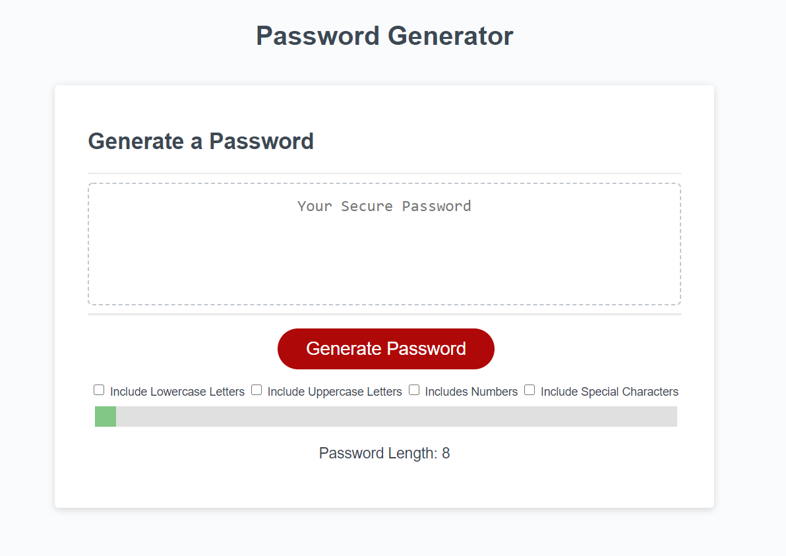
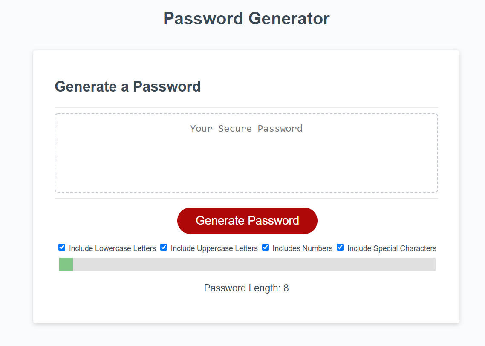
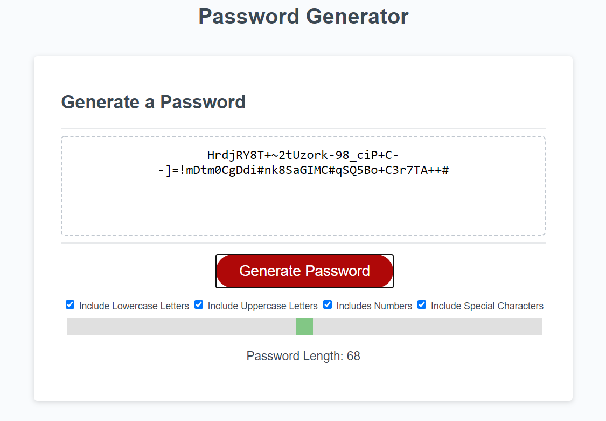

# Jack-s-Password-Generator

## Purpose of this Project
This project was created for the purpose of creating a generator that creates a random password based on user-determined critera (length of password & characters within the password).
## Goals of this Project
The primary goal of this project was to create a a random password generator capable of making passwords from anywhere between 8-128 characters and comprised out of lowercase letters, uppercase letters, numbers and special characters.
## Problems encountered in this Project
My original idea for how to code the generator turned out to be too overcomplicated. Took some brainstorming and research, eventually finding a working method to get the generator working successfully.

## Screenshots of Completed Project
###### Screenshot of Generator

###### Screenshot of Generator with all checkboxes checked

###### Screenshot of Generator with a randomly generated password displayed

## Links to Live Project/GitHub Repository
### https://github.com/Foggles/Jack-s-Password-Generator
### https://foggles.github.io/Jack-s-Password-Generator/